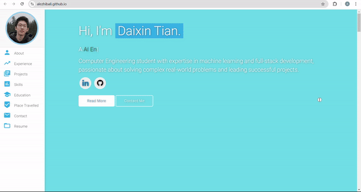
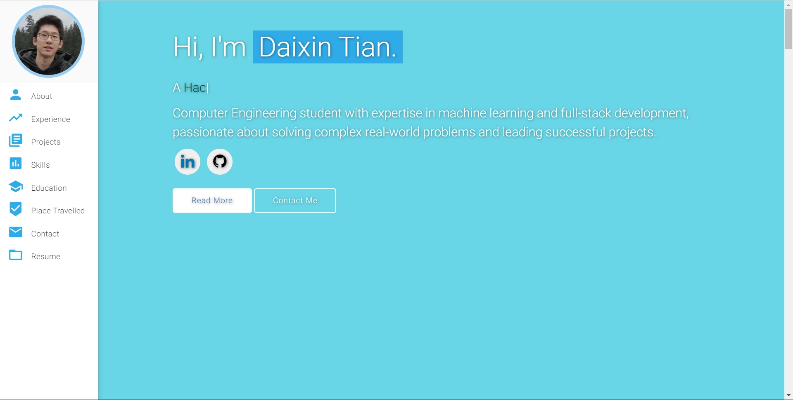
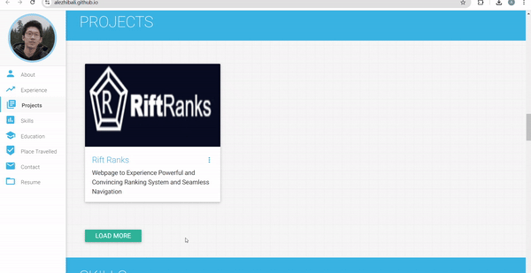

# Personal Portfolio ⚡️ 
> This is the Github Portfolio for Daixin Tian!

> This repo is a clone of https://github.com/varadbhogayata/varadbhogayata.github.io

> https://AlezHibali.github.io

### Website Preview

 
  <kbd>
    
  </kbd>

## Activity 1

## Activity 2
### Webpage

### Repo

## Activity 3
### Webpage

### Repo

## Activity 4
### Webpage

### Repo

## Activity 5
### Webpage

### Repo

## Sections 📚
✔️ About me\
✔️ Experience\
✔️ Projects \
✔️ Skills \
✔️ Education\
✔️ Place Travelled\
✔️ Contact Info\
✔️ Resume

## License 📄
This project is licensed under the MIT License - see the [LICENSE.md](./LICENSE) file for details.
